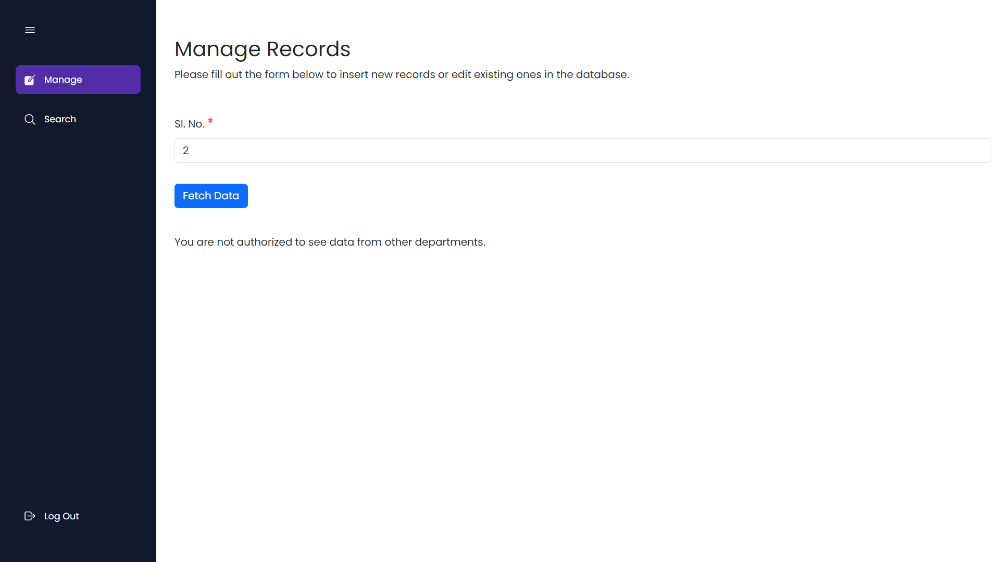

# SNP

SNP, short for Store and Purchase, represents a transformative project developed exclusively for the esteemed Indian Institute of Technology (IIT) Patna. Prior to this initiative, the management of store and purchase records at our college relied heavily on MS Excel, leading to inefficiencies and complexities.

Through this groundbreaking project, we have revolutionized the way store and purchase operations are conducted. Our platform offers a unified solution, enabling seamless management and optimization of all processes related to store inventory and procurement activities.

By centralizing these operations within a sophisticated and tailor-made platform, we have significantly enhanced efficiency, accuracy, and overall workflow management. SNP represents a leap forward in modernizing administrative functions, empowering institutions like IIT Patna to excel in their operational excellence.

URL: 
 - Admin: http://localhost/snp/
 - Client: http://localhost/snp/client/ 

## Advanced Functionalities and Technical Capabilities

Our system is meticulously designed to cater to the diverse needs of administrators and departmental users, offering a suite of cutting-edge functionalities and robust technical capabilities:

### Admin Functionality
1. Effortless Data Insertion: Seamlessly add new records to the system, with the ability to upload invoices for enhanced documentation and record-keeping.
2. Precision Editing: Edit existing records with pinpoint accuracy using unique serial numbers, ensuring data integrity and facilitating quick updates or corrections.
3. Swift Record Retrieval: Leverage the search function based on serial numbers for rapid access to specific records, streamlining data retrieval processes.
4. Data Export in CSV: Export stored data in CSV format, enabling comprehensive data analysis and seamless integration with external systems or stakeholders.
5. Supplier Management: Manage supplier details comprehensively within the system, providing a centralized solution for organizing and overseeing supplier information effectively.

### Departmental User Interface
1. Empowering User Experience: Empower departmental users with a user-friendly interface, allowing seamless insertion, editing, and searching of data within their designated departments.
2. Department-Based Access Control: Implement a stringent access control mechanism based on departments, preventing unauthorized access or manipulation of data across different departments.
3. Route-Level Security: Employ robust security measures to safeguard system routes, ensuring that authentication protocols are strictly enforced to prevent unauthorized access or tampering with system functionalities.

Our system not only delivers unparalleled functionalities but also upholds the highest standards of security and efficiency, making it an ideal choice for organizations seeking a sophisticated and reliable solution for data management and system administration.

## Screenshots

